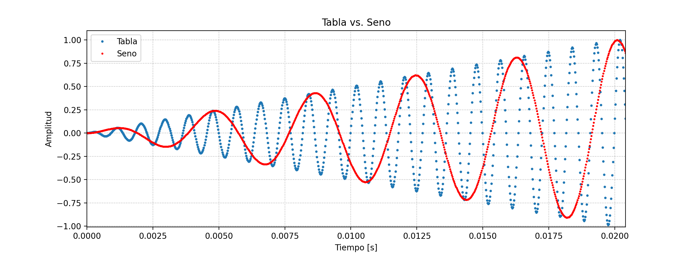
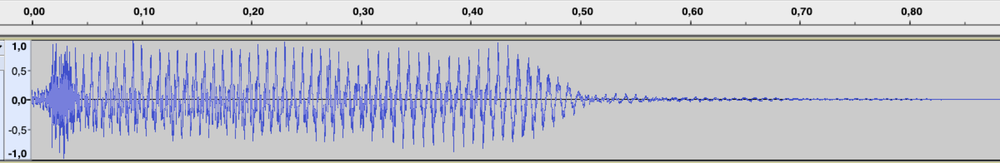
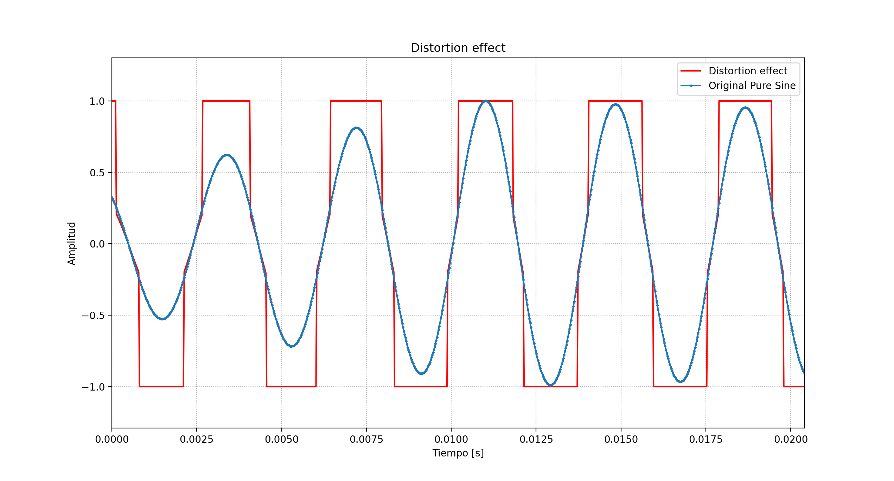

PAV - P5: síntesis musical polifónica
=====================================

**Obtenga su copia del repositorio de la práctica accediendo a [Práctica 5](https://github.com/albino-pav/P5) 
y pulsando sobre el botón `Fork` situado en la esquina superior derecha. A continuación, siga las
instrucciones de la [Práctica 2](https://github.com/albino-pav/P2) para crear una rama con el apellido de
los integrantes del grupo de prácticas, dar de alta al resto de integrantes como colaboradores del proyecto
y crear la copias locales del repositorio.**

**Como entrega deberá realizar un *pull request* con el contenido de su copia del repositorio. Recuerde que
los ficheros entregados deberán estar en condiciones de ser ejecutados con sólo ejecutar:**

~~~~~~~~~~~~~~~~~~~~~~~~~~~~~~~~~~~~~~~~~~~~~~~~~~~~~.sh
  make release
~~~~~~~~~~~~~~~~~~~~~~~~~~~~~~~~~~~~~~~~~~~~~~~~~~~~~

**A modo de memoria de la práctica, complete, en este mismo documento y usando el formato *markdown*, los
ejercicios indicados.**

Ejercicios.
-----------

### Envolvente ADSR.

**Tomando como modelo un instrumento sencillo (puede usar el InstrumentDumb), genere cuatro instrumentos que
permitan visualizar el funcionamiento de la curva ADSR.**

    
    
* **Un instrumento con una envolvente ADSR genérica, para el que se aprecie con claridad cada uno de sus parámetros: ataque (A), caída (D), mantenimiento (S) y liberación (R).**

    En la siguiente imágen podemos ver la envolvente ADSR de un instrumento genérico, en la que podemos apreciar todos los parámetros indicados.

    

* **Un instrumento *percusivo*, como una guitarra o un piano, en el que el sonido tenga un ataque rápido, no haya mantenimiemto y el sonido se apague lentamente.**
  - **Para un instrumento de este tipo, tenemos dos situaciones posibles:**
    * El intérprete mantiene la nota *pulsada* hasta su completa extinción.
    * El intérprete da por finalizada la nota antes de su completa extinción, iniciándose una disminución
	  abrupta del sonido hasta su finalización.
  - **Debera representar en esta memoria ambos posibles finales de la nota.**
  
    Proporcionamos a continuación las imágenes requeridas.
  
    
       
       
* **Un instrumento *plano*, como los de cuerdas frotadas (violines y semejantes) o algunos de viento. En ellos, el ataque es relativamente rápido hasta alcanzar el nivel de mantenimiento (sin sobrecarga), y la liberación también es bastante rápida.**

    Podemos visualizar los instrumentos a continuación.

    


**Para los cuatro casos, deberá incluir una gráfica en la que se visualice claramente la curva ADSR. Deberá
añadir la información necesaria para su correcta interpretación, aunque esa información puede reducirse a
colocar etiquetas y títulos adecuados en la propia gráfica (se valorará positivamente esta alternativa).**

### Instrumentos Dumb y Seno.

**Implemente el instrumento `Seno` tomando como modelo el `InstrumentDumb`. La señal deberá formarse
mediante búsqueda de los valores en una tabla.**

- **Incluya, a continuación, el código del fichero `seno.cpp` con los métodos de la clase Seno.**
    
    #### Seno

    ```cpp
    #include <iostream>
    #include <math.h>
    #include "seno.h"
    #include "keyvalue.h"
    #include <stdlib.h>

    using namespace upc;
    using namespace std;

    Seno::Seno(const std::string &param) 
      : adsr(SamplingRate, param) {
      bActive = false;
      x.resize(BSIZE);

      /*
        You can use the class keyvalue to parse "param" and configure your instrument.
        Take a Look at keyvalue.h    
      */
      KeyValue kv(param);
      int N;
    
      if (!kv.to_int("N",N))
        N = 40; //default value
  
      //Create a tbl with one period of a sinusoidal wave
      tbl.resize(N);
      phase = 0, step = 2 * M_PI /(float) N;
      index_aux = 0.0F;
      for (int i=0; i < N ; ++i) {
        tbl[i] = sin(phase);
        phase += step;
      }
    }
    
    void Seno::command(long cmd, long note, long vel) {
      if (cmd == 9) {		//'Key' pressed: attack begins
        bActive = true;
        adsr.start();
	A = vel / 127.;
        float f0 = pow(2, (float) (note - 69)/12) * 440;
        step_note = 2 * M_PI /(float) (SamplingRate / f0);
      }
      else if (cmd == 8) {	//'Key' released: sustain ends, release begins
        adsr.stop();
      }
      else if (cmd == 0) {	//Sound extinguished without waiting for release to end
        adsr.end();
      }
    }

    const vector<float> & Seno::synthesize() {
      if (not adsr.active()) {
        x.assign(x.size(), 0);
        bActive = false;
        return x;
      }
      else if (not bActive)
        return x;
      float alpha, beta; 
      for (unsigned int i=0; i<x.size(); ++i) {
        if(index_aux == round(index_aux)) {
          x[i] = A * tbl[index_aux];
        } else {
          index_pre  = floor(index_aux);
          index_post = ceil(index_aux);
          alpha = index_aux - index_pre;
          beta  = index_post - index_aux;
          if(index_post == tbl.size()) {
            index_post = 0;
            beta = tbl.size() - index_aux;
          }
          x[i] = A * (tbl[index_pre]*beta + tbl[index_post]*alpha);
        }
        index_aux += step_note / step;
	
        if(index_aux >= tbl.size())
          index_aux = index_aux - tbl.size();
      }
      adsr(x); //apply envelope to x and update internal status of ADSR
      return x;
    }
    ```

- **Explique qué método se ha seguido para asignar un valor a la señal a partir de los contenidos en la tabla,e incluya una gráfica en la que se vean claramente (use pelotitas en lugar de líneas) los valores de la tabla y los de la señal generada.**
  
    El primer paso ha sido calcular la frecuencia de la nota que se tiene que generar mediante la fórmula:
    
    **f0 = 2^( (Note - 69)/12 ) * 440**
    
    Ya que el valor de la nota viene expresado en semitonos y está fijado de tal manera que el La4 (440 Hz) se corresponde con la nota 69.
    
    Para recorrer la tabla se calcula un nuevo *step* (incremento del índice en cada iteración) que es el ratio entre el *step* de la nota y el *step* de la onda sinusoidal de la tabla. El *step* de la nota se calcula así: _**step_note**_ **= 2π/(SamplingRate/f0)**
    
    Hemos implementado directamente una interpolación lineal para así evitar la distorsión que generaríamos cuando el índice tuviera un valor no entero. La interpolación se calcula mediante los valores anteriores y posteriores al índice teniendo en cuenta la distancia a cada uno de ellos y manteniendo la fase en todo momento, incluso cuando la muestra se encuentra entre la última y primera posición de la tabla.
    
    Ejemplo donde el gráfico azul muestra el sonido de InstrumentDumb y el gráfico rojo muestra el sonido del instrumento Seno con el Do4:
    
    
    
    
- **Si ha implementado la síntesis por tabla almacenada en fichero externo, incluya a continuación el código del método `command()`.**
  
    #### Tabla externa
    
    Hemos implementado la síntesis por tabla almacenada en fichero externo pero no ha sido necesario modificar el método `command()`. Las únicas modificaciones respecto al instrumento Seno han sido en el constructor:
    
    ```cpp
    TablaExt::TablaExt(const std::string &param) 
      : adsr(SamplingRate, param) {
      bActive = false;
      x.resize(BSIZE);

      KeyValue kv(param);
      int N;
      if (!kv.to_int("N",N))
        N = 40; //default value
      std::string file_name;
      static string kv_null;
    
      if ((file_name = kv("file")) == kv_null) {
       cerr << "Error: no se ha encontrado el campo con el fichero de la señal para ··· 􏰄→ un instrumento FicTabla" << endl;
        throw -1; 
      }
      unsigned int fm;
      if (readwav_mono(file_name, fm, tbl) < 0) {
        cerr << "Error: no se puede leer el fichero " << file_name << " para un ··· 􏰄→ instrumento FicTabla" << endl;
        throw -1; 
      }
      N = tbl.size();
      step = 2 * M_PI /(float) N;
      index_aux = 0.0F;
    }
    ```
    
    Hemos provado diferentes tablas externas y la que ha quedado mejor es la de un sonido de flauta, aunque podemos reafirmar que el sonido se puede parecer más al de un *organillo de mala calidad* que al del instrumento real como ya se ha avisado. Resultado:
    
    
    
    
     <br />
     
    
    
    
    
    #### Samplers

    También hemos implementado un *sampler*, un tipo de instrumento que recorre la tabla entera con un incremento de fase de valor 1 (como en InstrumentDumb) para que así no se vea modificada la grabación del sonido. Hemos dejado sin efecto los comandos **NoteOff** y **SoundOff** para que se reproduzca toda la grabación. Cuando se llega al final de la tabla se llama a la función `adsr.end()`. 
  
    Este tipo de instrumento tiene sentido cuando se quiere reproducir sonidos percusivos como *kicks*, *cymbals*,... También cuando se quiere reproducir, por ejemplo, *Vocal Shots*. En estos casos, las duraciones suelen ser mucho mas largas que un solo periodo y no tiene sentido hablar de pitch ni repetir el sonido de forma periódica, ya que sólo se pretende reproducir el sonido ya grabado sin modificaciones.
  
    Ejemplo percusivo – *Open Hi-Hat*:
  
    

    Ejemplo `Vocal Shot`– Voz robótica "girl":
  
    
  

### Efectos sonoros.

- **Incluya dos gráficas en las que se vean, claramente, el efecto del trémolo y el vibrato sobre una señal sinusoidal. Deberá explicar detalladamente cómo se manifiestan los parámetros del efecto (frecuencia e índice de modulación) en la señal generada (se valorará que la explicación esté contenida en las propias gráficas, sin necesidad de *literatura*).**

    Hemos aplicado los efectos sobre la siguiente nota:

    

    #### Trémolo

    El resultado del efecto trémolo con los parámetros indicados en el PDF ( A = 0.5, fm = 10 ) es el siguiente:

    

    Se puede apreciar la envolvente generada por el trémolo sobre nuestra señal original con la frecuencia y la profundidad de modulación asignados. Hemos remarcado la envolvente en color rojo. La oscilación en el trémolo será más rápida si aumentamos *fm* y el cambio de amplitud será más notable si aumentamos *A*.

    #### Vibrato

    El resultado del efecto vibrato con los parámetros indicados en el PDF ( I = 0.5, fm = 8 ) es el siguiente:

    

    Nuestra señal original sufre modificaciones con la frecuencia indicada en el parámetro *fm*, y con el índice de modulación indicado en el parámetro *I*. El cambio en el pitch es más rápido si aumentamos *fm* y el cambio es más notable si aumentamos *I*, expresado en semitonos.

    Si usamos un parámetro *I* más exagerado ( I = 30, fm = 8 ), obtenemos lo siguiente:

    

    Vemos como aumenta notablemente la profundidad del vibrato manteniendo su frecuencia.


- **Si ha generado algún efecto por su cuenta, explique en qué consiste, cómo lo ha implementado y qué resultado ha producido. Incluya, en el directorio `work/ejemplos`, los ficheros necesarios para apreciar el efecto, e indique, a continuación, la orden necesaria para generar los ficheros de audio usando el programa `synth`.**

    #### Distortion
    
    Hemos implementado el efecto de distorsión (típico sobretodo en guitarras eléctricas y musica electrónica de todo tipo) de una manera muy sencilla. Hemos escogido la distorsión mediante la saturación del señal. Cuando una muestra del señal original supera un *threshold* la muestra resultante se modifica al valor ±1. Un ejemplo claro es ver como si se aplica este efecto a una señal sinusoidal pura, el resultado se parece mas a una señal cuadrada y, por tanto, con muchos armónicos.

    
    
    Vemos su efecto en frecuencia:
    
    | Seno puro                                        | Efecto distorsión                                       |
    |--------------------------------------------------|---------------------------------------------------------|
    |  |  |
    
    Orden: `$ bin/synth work/seno.orc work/ejemplos/distortion/doremi_distortion.sco work/ejemplos/distortion/seno_distortion.wav -e work/effects.orc`

### Síntesis FM.

**Construya un instrumento de síntesis FM, según las explicaciones contenidas en el enunciado y el artículo
de [John M. Chowning](https://ccrma.stanford.edu/sites/default/files/user/jc/fm_synthesispaper-2.pdf). El
instrumento usará como parámetros básicos los números `N1` y `N2`, y el índice de modulación `I`, que
deberá venir expresado en semitonos.**

- **Use el instrumento para generar un vibrato de *parámetros razonables* e incluya una gráfica en la que se vea, claramente, la correspondencia entre los valores `N1`, `N2` e `I` con la señal obtenida.**

    Utilizando los parámetros N1 = 3, N2 = 20, I = 10, obtenemos un resultado en el que se pueden visualizar de manera clara las consecuencias de este efecto:

    

    Los valores N1 y N2 están relacionados con el parámetro fm del vibrato, afectando a la frecuencia del efecto, mientras que el valor I sigue siendo la profunidad expresada en semitonos. En este caso aplicamos una profundidad de 10 semitonos, que es muy notable su efecto al escuchar el clip. Las posibilidades con estos parámetros son infinitas, combinándolos con las variables ADSR se puede conseguir una infinidad de instrumentos sorprendentes.


- **Use el instrumento para generar un sonido tipo clarinete y otro tipo campana. Tome los parámetros del sonido (N1, N2 e I) y de la envolvente ADSR del citado artículo. Con estos sonidos, genere sendas escala diatónicas (fichero `doremi.sco`) y ponga el resultado en los ficheros `work/doremi/clarinete.wav` y `work/doremi/campana.work`.**

    Hemos incluido el resultado en los ficheros correspondientes, utilizando los valores de N1 y N2 especificados en el paper de John M. Chowning.


  * **También puede colgar en el directorio work/doremi otras escalas usando sonidos *interesantes*. Por ejemplo, violines, pianos, percusiones, espadas láser de la [Guerra de las Galaxias](https://www.starwars.com/), etc.**

    Conseguir un resultado que suene como un instrumento a partir de este efecto es un poco complicado, ya que hay varios parámetros a tener en cuenta, y no encontramos demasiada información en internet. 

    Sin embargo, nos lanzamos a conseguir un sonido que podría estar en la Guerra de las Galaxias. Para conseguir estos sonidos "galácticos" solo había que ir probando valores absurdos hasta conseguir uno que diese la talla. El sonido que hemos conseguido nos recuerda a [un sonido que escucharon los tripulantes del Apolo 10](https://www.youtube.com/watch?v=mhEEPqgGRXo) cuando orbitaban cerca de la Luna.

### Orquestación usando el programa synth. :notes: :musical_note: :notes: :musical_note: :notes: :musical_note: :notes: :musical_note:

**Use el programa `synth` para generar canciones a partir de su partitura MIDI. Como mínimo, deberá incluir la
*orquestación* de la canción *You've got a friend in me* (fichero `ToyStory_A_Friend_in_me.sco`) del genial [Randy Newman](https://open.spotify.com/artist/3HQyFCFFfJO3KKBlUfZsyW/about).**

- **En este triste arreglo, la pista 1 corresponde al instrumento solista (puede ser un piano, flautas, violines, etc.), y la 2 al bajo (bajo eléctrico, contrabajo, tuba, etc.).**
- **Coloque el resultado, junto con los ficheros necesarios para generarlo, en el directorio `work/music`.**
- **Indique, a continuación, la orden necesaria para generar la señal (suponiendo que todos los archivos necesarios están en directorio indicado).**

**También puede orquestar otros temas más complejos, como la banda sonora de *Hawaii5-0* o el villacinco de
John Lennon *Happy Xmas (War Is Over)* (fichero `The_Christmas_Song_Lennon.sco`), o cualquier otra canción
de su agrado o composición. Se valorará la riqueza instrumental, su modelado y el resultado final.**
- **Coloque los ficheros generados, junto a sus ficheros `score`, `instruments` y `efffects`, en el directorio `work/music`.**
- **Indique, a continuación, la orden necesaria para generar cada una de las señales usando los distintos ficheros.**
  
  Hemos realizado la instrumentación de *You've got a friend in me* (Toy Story), *Hawaii 5.0*, *Happy Xmas (War Is Over)* y de una canción compuesta por uno de nosotros. Para ello, hemos usado muchos Samplers ya que son ideales para los sonidos percusivos como *kicks, hi-hats, toms, snares,...*. Los *samples* (trozos de sonido grabados) se encuentran en el directorio `work/samples`. También hemos utilitzado tablas externas y Síntesis FM para instrumentos como el piano, el bajo y la guitarra, y el resultado ha sido bastante satisfactorio. Las tablas externas se encuentran en el directorio `work/tablas_externas`.
  
  A continuación, os mostramos nuestro repertorio. Podéis encontrar los ficheros de audio en el directorio `work/music`de forma totalmente gratuita!  :stuck_out_tongue_closed_eyes:
  
  #### You've got a friend in me (Toy Story)
  
  
  
  `$ bin/synth work/music/toy_story.orc work/music/toy_story.sco work/music/toy_story.wav -t 154`
  
  NOTA: Hemos modificado los ticks para que el bpm resultante fuese igual al de la canción original, 116 bpm. Sin esa modificación la canción orquestrada resultante tenía una velocidad de 91 bpm. 
  
  #### Hawaii 5.0 Theme Song
  
   
  
  Sin duda, la canción más completa!
  
  `$ bin/synth work/music/hawaii.orc work/music/hawaii.sco work/music/hawaii.wav -b 163`
  
  #### John Lennon - Happy Christmas War Is Over

   

  NOTA: Solo en este caso, al orquestrar la canción no se nos reconocen ciertos instrumentos. Por lo tanto, la orquestración final está compuesta únicamente por los tracks del 3 al 10. La canción suena igual de bien ya que todos los instrumentos que no se han reconocido son los de percusión (*drums, snares, hi hats,...*), quedando los acordes y la melodía intactos.
  
  `$ bin/synth work/music/lennon.orc work/music/lennon.sco work/music/lennon.wav -g 0.1 -b 150`    

  
  #### David Bonet - Desire is the key
  
   
  
  Y para terminar... Una canción a piano compuesta por uno de nosotros. Hemos creado el fichero MIDI en **Ableton**, un DAW (*Digital Audio Workstation*) muy común en el mundo de la producción.
  
  Para generar el fichero .sco hemos utilizado la siguiente orden:
  
  `$ bin/midi2sco work/music/david_desire.mid work/music/david_desire.sco`

  Y para generar el fichero de audio:
  
  `$ bin/synth work/music/david_desire.orc work/music/david_desire.sco work/music/david_desire.wav -b 93 -g 0.3`

  #### Esperamos que os gusten!! :grin::notes:
